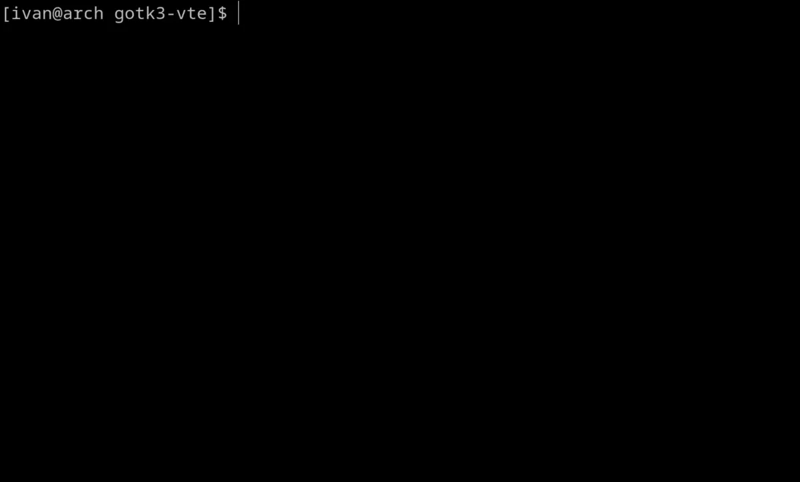

# Properties

You can configure `vte.Terminal` widget by setting its properties.

```go
package main

import (
	"log"

	"github.com/gotk3/gotk3/gtk"
	"github.com/shelepuginivan/gotk3-vte/vte"
)

func main() {
    // ...

	term.SetFontFromString("monospace 16")
	term.SetCursorBlinkMode(vte.CURSOR_BLINK_OFF)
	term.SetCursorShape(vte.CURSOR_SHAPE_IBEAM)

    // ...
}
```

Here, we changed 3 properties:

- `vte.SetFontFromString` &mdash; configures font
- `vte.SetCursorShape` &mdash; changes the shape of the cursor
- `vte.SetCursorBlinkMode` &mdash; controls whether the cursor blinks

This is how the terminal looks now:


