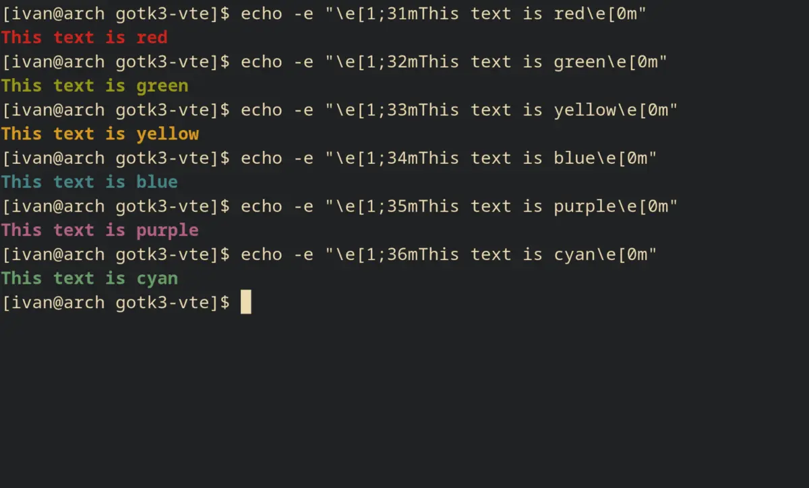
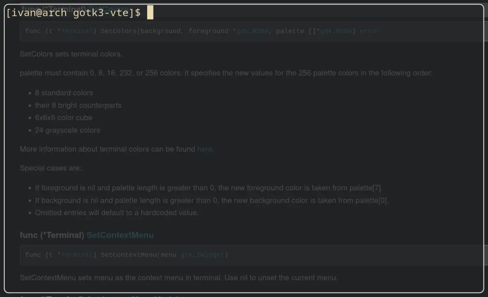

# Colors

## Setting color palette

By default, VTE uses a set of hardcoded colors, but you can specify your own
palette.

```go
package main

import (
	"log"

	"github.com/gotk3/gotk3/gdk"
	"github.com/gotk3/gotk3/gtk"
	"github.com/shelepuginivan/gotk3-vte/vte"
)

func main() {
    // ...

    term.SetColors(
    	gdk.NewRGBA(0.129, 0.133, 0.137, 1),        // Background color.
    	gdk.NewRGBA(0.922, 0.859, 0.698, 1),        // Foreground color.
    	[]*gdk.RGBA{                                // Color palette.
    		gdk.NewRGBA(0.157, 0.157, 0.157, 1),
    		gdk.NewRGBA(0.800, 0.141, 0.114, 1),
    		gdk.NewRGBA(0.596, 0.592, 0.102, 1),
    		gdk.NewRGBA(0.843, 0.600, 0.129, 1),
    		gdk.NewRGBA(0.271, 0.522, 0.533, 1),
    		gdk.NewRGBA(0.694, 0.384, 0.525, 1),
    		gdk.NewRGBA(0.408, 0.616, 0.416, 1),
    		gdk.NewRGBA(0.659, 0.600, 0.518, 1),
    	},
    )

    // ...
}
```

Now, the terminal will use color palette that we configured:



A palette may contain 0, 8, 16, 232, or 256 colors. See [ANSI escape
code](https://en.wikipedia.org/wiki/ANSI_escape_code#8-bit) for more
information about terminal colors.

## Transparency

You can configure GTK window to be transparent and use a semi-transparent color
for terminal background:

```go
package main

import (
	"log"

	"github.com/gotk3/gotk3/gdk"
	"github.com/gotk3/gotk3/gtk"
	"github.com/shelepuginivan/gotk3-vte/vte"
)

func main() {
    // ...

    term.SetColors(
    	gdk.NewRGBA(0.129, 0.133, 0.137, 0.8),    // Now the alpha component is 0.8
    	gdk.NewRGBA(0.922, 0.859, 0.698, 1),
    	[]*gdk.RGBA{
    		gdk.NewRGBA(0.157, 0.157, 0.157, 1),
    		gdk.NewRGBA(0.800, 0.141, 0.114, 1),
    		gdk.NewRGBA(0.596, 0.592, 0.102, 1),
    		gdk.NewRGBA(0.843, 0.600, 0.129, 1),
    		gdk.NewRGBA(0.271, 0.522, 0.533, 1),
    		gdk.NewRGBA(0.694, 0.384, 0.525, 1),
    		gdk.NewRGBA(0.408, 0.616, 0.416, 1),
    		gdk.NewRGBA(0.659, 0.600, 0.518, 1),
    	},
    )

    win.SetAppPaintable(true)
	screen := win.GetScreen()

	visual, err := screen.GetRGBAVisual()
	if err == nil {
		win.SetVisual(visual)
	}

    // ...
}
```


