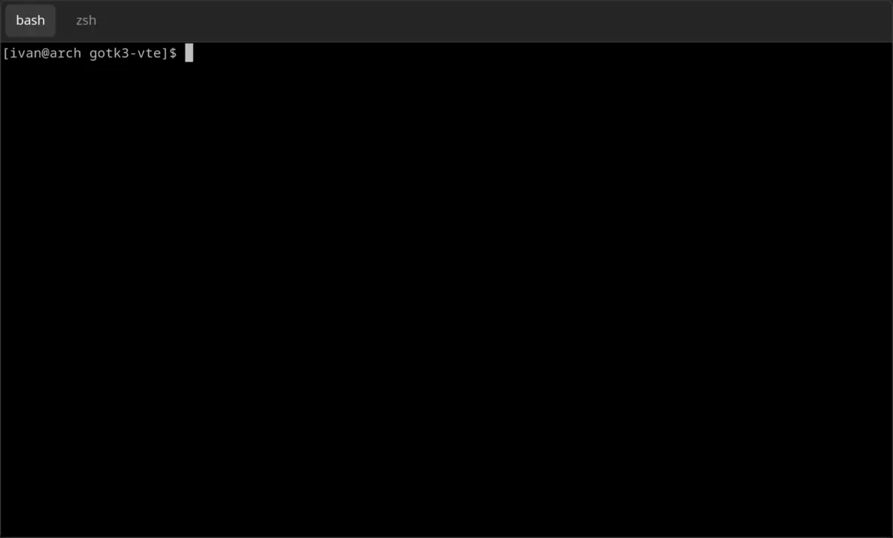

# Terminal widget

[`vte.Terminal`](https://pkg.go.dev/github.com/shelepuginivan/gotk3-vte/vte#Terminal)
embeds [`gtk.Widget`](https://pkg.go.dev/github.com/gotk3/gotk3/gtk#Widget), so
it can be used as a regular widget.

```go
package main

import (
	"log"

	"github.com/gotk3/gotk3/gtk"
	"github.com/shelepuginivan/gotk3-vte/vte"
)

func main() {
	gtk.Init(nil)

	win, err := gtk.WindowNew(gtk.WINDOW_TOPLEVEL)
	if err != nil {
		log.Fatal(err)
	}

	notebook, err := gtk.NotebookNew()
	if err != nil {
		log.Fatal(err)
	}

	label1, _ := gtk.LabelNew("bash")
	term1, _ := vte.TerminalNew()
	term1.Spawn(vte.CommandNew([]string{"/usr/bin/bash"}))
	notebook.AppendPage(term1, label1)

	label2, _ := gtk.LabelNew("zsh")
	term2, _ := vte.TerminalNew()
	term2.Spawn(vte.CommandNew([]string{"/usr/bin/zsh"}))
	notebook.AppendPage(term2, label2)

	win.Add(notebook)
	win.ShowAll()
	win.Connect("destroy", gtk.MainQuit)

	gtk.Main()
}
```

In the example above, two terminal widgets are added as notebook pages.
Thus, we get a very simple multiplexing:


